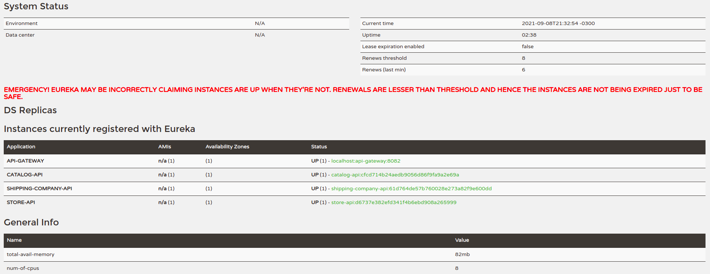

# store-sale
Pequeno sistema de vendas on line de uma loja com spring cloud.
Este é um workflow baseado em microservices utilizando as stacks do spring cloud...
É um conceito para utilização de comunicação entre microsevirços em HTTP request bem básico. Mas com ganchos para arquitetura de eventos como kafka cloud.

Obs: Um um bug no api gatway na parametrização que vi antes antes de dar o primeiro comit. Porém, não foi ajeitado ainda. Ajeitarei em breve, pois as request com paths que possuem parametros o api gateway não esta registrando. 

Exemplo: (shipping-company-api - http://localhost:8082/v1/requests/trackings/6f1594fc-6aa6-4ad8-83ed-30b437e0b2ea/order/3)


## Como rodar as aplicações springboot

 1° - Para cada API (catalog-app, store-app, shipping-company-api) no terminal, cole este comando e aperte "enter" 
```shell script
 docker-compose up
```

2° - Subir as aplicações de discovery service e api gateway do spring cloud:

```shell script
 mvn spring-boot:run
```

2° - Subir as apis: catalog-app, store-app, shipping-company-api:
 
 ```shell script
 mvn spring-boot:run
 ```

## Url's swagger

Para acessar o swagger das aplicações, se atentar em visualizar a porta que é gerada de forma randomica.



- [store-sale] - http://localhost/{PORT}/swagger-ui/index.html
- [shipping-company-api] - http://localhost/{PORT}/swagger-ui/index.html
- [store-api] - http://localhost/{PORT}/swagger-ui/index.html

## Commits Guideline

Nós possuímos regras e padrões sobre como as nossas mensagens de commit devem ser formatadas. Isso nós oferece uma melhor experiência na hora de acompaharmos o history do projeto.

Utilizamos o padrão de [conventional commits](https://www.conventionalcommits.org/), logo todos os commits neste repositório deverão seguir essa convenção.

### Formato do Commit

Cada mensagem de commit pode conter um **header**, um **body** e um **footer**. O header possui um formato especial que pode conter um **type**, uma **task** (task ou história do jira) e um **subject**.

```
<type>(<task>): <subject>
<body>
<footer>
```

O **type** e o **subject** são obrigatórios.

Exemplo:

`docs: change README about CICD`

### Tipos de Commits

| Tipo    | Função                                                                      |
| ------- | --------------------------------------------------------------------------- |
| _feat_  | Uma nova implementação / feature                                            |
| _build_ | Modificações que afetam as ferramentas de build                             |
| _ci_    | Modificações nos arquivos e nos scripts de configuração de CI               |
| _docs_  | Modificações em documentações e afins                                       |
| _fix_   | Correção de um bug                                                          |
| _perf_  | Modificações de código para otimizar performance                            |
| _impr_  | Modificações que não necessariamente é um fix ou nova feature               |
| _style_ | Mudanças que não modifiquem lógica (white-space, formatting, prettier, etc) |
| _test_  | Testes que foram adicionados ou corrigidos                                  |
| _chore_ | Uma modificação geral que não se enquandra em nenhum outro padrão           |
